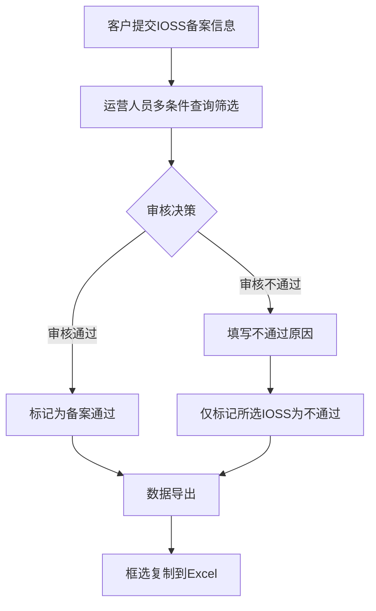

# IOSS税号管理 - 需求文档

## 需求修订记录

| 修订日期 | 版本号 | 修订人 | 修订内容 | 修订理由 |
|---------|--------|--------|---------|---------|
| 2026-07-20 | V1.0.0 | 卓运康 | 初始版本：新增IOSS密文列、创建时间搜索、列框选复制、隐藏IOSS识别名、审核不通过逻辑优化 | 原型实现后补录PRD |

---

# 一、需求背景

- **业务背景**：IOSS（Import One Stop Shop）是欧盟进口一站式服务税号简称。在国际物流业务中，客户需将IOSS税号提交运营方备案审核以便合规申报。当前IOSS税号管理页面已支持基础查询和批量审核，但在数据安全展示、筛选维度、数据转录效率和审核逻辑准确性上仍有不足。
- **现状问题**：
  1. 数据安全：IOSS识别名列为客户自行填写的备注，部分客户将明文身份信息填入该栏，存在隐私泄露风险
  2. 筛选维度缺失：搜索条件仅支持客户代码、IOSS识别码、审核类型和状态四种维度，无法按创建时间快速定位数据
  3. 数据转录低效：列表列不支持选中和复制，运营人员需手动逐条转录数据到Excel或其他系统，易出错
  4. 审核逻辑缺陷：审核不通过操作可能影响多个客户的IOSS记录，缺少客户隔离校验
- **需求目的**：
  1. 隐藏IOSS识别名列，在IOSS识别码后新增密文列，保护客户数据隐私
  2. 新增创建时间筛选维度，提升按时间范围检索的效率
  3. 支持表格单元格框选复制，方便运营人员将数据导出到线下处理
  4. 优化审核不通过逻辑，确保仅影响当前选中的IOSS记录，不波及同一客户的其他IOSS

---

# 二、业务价值

**客户 · 风险/合规指标**
- 【定性】敏感数据（IOSS识别名）不再直接暴露，增强客户数据安全感
- 【定量】IOSS识别名展示机会降为0

**组织内部 · 提效指标**
- 【定性】减少运营人员手动转录数据环节，通过框选Ctrl+C复制提升日常审核处理效率
- 【定量】预计节省运营人员 1H/天（从手动逐条转录改为框选复制）

**组织内部 · 业务指标**
- 【定性】审核不通过仅影响指定IOSS，避免误伤其他记录，提升审核准确性

---

# 三、业务指标达成

## 1、定性指标

| 指标名称 | 验证方式 | 验证对象 | 验证周期 | 备注 |
|---------|---------|---------|---------|------|
| 运营人员复制效率提升 | 观察/访谈 | 运营团队 | 上线后 2 周 | 对比上线前后手动转录频率 |
| 数据隐私泄露风险降低 | 安全审计 | 信息安全管理 | 上线后 1 月 | 确认识别名列不再展示 |
| 审核不通过隔离准确性 | 测试用例验证 | QA/运营 | 上线前 | 同一客户多IOSS场景下验证 |

---

## 2、定量达标

### 2.1 关键指标定义

| 指标名称 | 指标定义 | 计算方式 | 取值来源 | 目标值 | 统计周期 |
|---------|---------|---------|---------|--------|---------|
| 复制功能使用率 | 页面内使用框选复制次数 | 框选复制事件次数 | 前端埋点 | 日均使用 ≥20次 | 周 |
| IOSS识别名展示次数 | 页面加载时识别名列渲染次数 | 渲染次数 | 前端监控 | 0次 | 日 |
| 误操作投诉率 | 因审核不通过误伤其他IOSS产生的投诉 | 投诉次数 | 客服工单 | 0次 | 月 |

### 2.2 数据采集方案

| 数据点 | 采集方式 | 采集频率 | 数据负责人 | 报表/看板 |
|--------|---------|---------|-----------|----------|
| 框选复制事件 | 前端埋点上报 | 实时 | 前端开发 | 数据看板 |
| 创建时间筛选使用 | 前端请求日志 | 实时 | 前端开发 | 数据看板 |

---

## 3、指标跟踪机制

| 阶段 | 跟踪内容 | 跟进人 | 输出物 |
|------|---------|--------|--------|
| 上线首周 | 核心指标基线确认 | 产品经理 | 基线数据报告 |
| 上线首月 | 指标达成情况分析 | 产品经理 | 月度复盘报告 |

---

# 四、业务场景

| 需求 | 角色分类 | 角色身份 | 行为（业务场景） | 行为要求（场景要求） |
|------|---------|---------|----------------|-------------------|
| IOSS密文展示 | 内部用户 | 审核人员 | 查看IOSS识别码对应的密文映射 | 密文为确定性加密串，可反向校验但不可还原原始码 |
| 创建时间筛选 | 内部用户 | 审核人员 | 选择日期范围筛选指定时间段创建的记录 | 起止日期精确到天，与其它条件组合筛选 |
| 列框选复制 | 内部用户 | 运营人员/审核人员 | 拖拽框选矩形区域，Ctrl+C复制为TSV格式文本 | 含表头、制表符分隔、可粘贴到Excel保持列结构 |
| 隐藏IOSS识别名 | 内部用户 | 审核人员 | 表格不再展示IOSS识别名列 | 后台保留该字段数据，前端不渲染 |
| 审核不通过隔离 | 内部用户 | 审核人员 | 勾选某客户的特定IOSS后点击审核不通过，仅该IOSS被标记 | 同一客户的其他IOSS记录不受影响 |

---

# 五、需求范围

- **系统环境**：中国区
- **业务模式**：YT（B2B-OMS相关）
- **涉及系统**：OMS（订单管理系统）
- **涉及模块**：IOSS税号管理
- **涉及角色**：运营人员、审核人员
- **核心能力**：
  1. IOSS税号密文加密展示
  2. 创建时间维度筛选增强
  3. 表格单元格框选复制
  4. 敏感字段（识别名）前端隐藏
  5. 审核不通过隔离（仅影响选中记录，不波及同一客户其他IOSS）

---

# 六、流程图

| 流程节点 | 角色 | 操作 | 系统/页面 |
|---------|------|------|----------|
| 提交备案 | 客户 | 在系统中提交IOSS税号及识别名等备案信息 | OMS-下单/预报 |
| 查询筛选 | 运营 | 通过客户代码、IOSS识别码、审核类型、状态、创建时间组合筛选 | IOSS税号管理页 |
| 审核通过 | 运营 | 勾选记录点击审核通过 | IOSS税号管理页 |
| 审核不通过 | 运营 | 勾选记录+填写原因，仅标记选中记录，同一客户其他IOSS不受影响 | IOSS税号管理页 |
| 数据导出 | 运营 | 拖拽框选矩形区域，Ctrl+C复制TSV文本粘贴到Excel | IOSS税号管理页 |

---

# 七、功能清单

| 序号 | 系统 | 菜单/模块 | 最终效果 |
|------|------|----------|---------|
| 01 | OMS | IOSS税号管理 | 表格新增IOSS密文列，展示确定性加密串；隐藏IOSS识别名列 |
| 02 | OMS | IOSS税号管理 | 搜索栏新增创建时间日期范围选择器，支持按时间段筛选 |
| 03 | OMS | IOSS税号管理 | 表格支持单元格框选复制（拖拽选矩形+Ctrl+C复制为TSV） |
| 04 | OMS | IOSS税号管理 | 操作栏新增复制选中(N)和取消选中按钮 |
| 05 | OMS | IOSS税号管理 | 审核不通过仅标记当前选中的IOSS，同一客户其他IOSS不受影响 |

---

# 八、功能描述

### 1.1 IOSS密文列

- **功能说明**：在IOSS识别码列之后新增IOSS密文列，基于识别码生成确定性加密串，用于脱敏展示和反向校验。
- **操作路径**：
  1. 进入IOSS税号管理页面
  2. 表格自动展示IOSS密文列（位于IOSS识别码列之后）
  3. 每个识别码对应唯一密文，长度与识别码字符数相同
- **界面交互规则**：
  - 列宽180px，超长时省略号截断
  - 密文为纯字母数字串（A-Za-z2-9，排除0O1l等易混淆字符）
- **业务逻辑规则**：
  - 加密算法：FNV-1a哈希（种子0x811c9dc5），遍历识别码每个字符累积哈希
  - 输出映射：哈希值对58取模，映射到58字符集
  - 确定性：同一识别码始终生成同一密文串

- **示例说明**：

| 场景 | IOSS识别码 | IOSS密文 | 说明 |
|------|-----------|---------|------|
| 正常 | IOSS26199132842172712763 | kH8xQp3mWnL5vRjYtFs | 长度等于识别码字符数 |
| 不同识别码 | IOSS26197153103093419470 | pL9yRq5xNvK3wMtGdHj | 不同输入产生不同密文 |

- **字段说明**：

| 字段名称 | 组件类型 | 必填性 | 规则约束 | 示例值 |
| -------- | -------- | ------ | -------- | ------ |
| IOSS密文 | 表格列（文本） | 否 | 后端计算返回，前端仅展示 | kH8xQp3mWnL5vR |

---

### 1.2 创建时间搜索

- **功能说明**：搜索栏新增创建时间日期范围选择器，支持按时间段筛选IOSS税号记录。
- **操作路径**：
  1. 进入IOSS税号管理页面
  2. 在搜索栏找到创建时间字段
  3. 点击日期选择器，选择开始日期和结束日期
  4. 点击查询按钮，列表按所选时间范围筛选
  5. 点击重置恢复全部数据并清除时间选择
- **界面交互规则**：
  - 使用RangePicker组件，选择起止日期
  - 筛选条件可与客户代码、IOSS识别码、审核类型、状态任意组合
  - 清空条件时恢复展示全部数据
- **业务逻辑规则**：
  - 筛选逻辑：记录创建时间在选定日期的0:00至23:59之间
  - 时间格式：YYYY-MM-DD HH:mm:ss
  - 空值处理：时间为空的记录不匹配任何时间筛选

---

### 1.3 列框选复制功能

- **功能说明**：表格支持多格框选复制：鼠标拖拽选中矩形区域，Ctrl+C或点击按钮复制为含表头TSV格式文本。
- **操作路径**：
  1. 鼠标按下某个单元格开始框选
  2. 拖拽鼠标选中矩形区域（选中格高亮为蓝色#bae0ff）
  3. 松开鼠标完成选择
  4. 按Ctrl+C或点击操作栏复制选中(N)按钮
  5. 内容以TSV格式（制表符分隔列、换行符分隔行）复制到剪贴板
  6. 复制成功提示已复制N个单元格
- **界面交互规则**：
  - 选中单元格背景变为蓝色，与Excel框选一致
  - 操作栏显示复制选中(N)按钮，N为选中格数
  - 操作栏同时显示取消选中按钮
  - 表格td设置user-select:none、cursor:cell
  - 复制内容首行含列标题
- **业务逻辑规则**：
  - 复制数据通过SELECTABLE_COLS定义顺序和取值逻辑
  - 剪贴板写入优先使用navigator.clipboard API
  - 非安全上下文降级为document.execCommand方案
  - 复制失败时弹出Modal展示完整文本，提供复制重试按钮
  - IOSS识别码和密文列启用省略号截断，与复制行为互不影响

- **示例说明**：

| 场景 | 操作 | 剪贴板内容 |
|------|------|-----------|
| 框选3行2列 | 拖选客户代码+IOSS识别码 | 含表头TSV，共4行（含表头） |
| Ctrl+C触发 | 框选后按Ctrl+C | 同按钮点击效果 |
| 非安全上下文 | HTTP页面框选复制 | 降级execCommand，失败弹Modal |

---

### 1.4 隐藏IOSS识别名列

- **功能说明**：将IOSS识别名列从表格中隐藏（从列定义中移除），后台数据保留该字段但前端不渲染。
- **操作路径**：
  1. 进入IOSS税号管理页面
  2. 表格中再也看不到IOSS识别名列
- **界面交互规则**：
  - 原列位置被IOSS密文列替代
  - 列顺序：序号、客户代码、类型、平台名称、IOSS识别码、IOSS密文、审核类型、状态、审核不通过备注、注册文件、操作
- **业务逻辑规则**：
  - recognized_name字段仍存在于数据源，仅在SELECTABLE_COLS和columns定义中排除
  - 导出CSV同样不包含该列
  - 原因：该列含客户自行填入的明文身份信息，存在隐私泄露风险

---

### 1.5 审核不通过逻辑优化

- **功能说明**：审核不通过操作仅标记当前勾选的具体IOSS记录，不波及同一客户名下的其他IOSS记录，确保审核粒度精确到单条记录。
- **操作路径**：
  1. 在IOSS税号管理页面勾选需要标记为不通过的记录
  2. 点击审核不通过按钮
  3. 弹出确认窗口，可选填不通过原因
  4. 点击确定，仅所选记录状态变更为审核不通过
- **界面交互规则**：
  - 操作前校验：未勾选任何记录时按钮禁用，提示"请先选择记录"
  - 确认弹窗：标题"批量审核不通过"，含不通过原因输入框
  - 操作成功后显示已标记N条为审核不通过的提示
- **业务逻辑规则**：
  - 更新范围：仅更新selectedRowKeys（用户勾选的行key）对应的记录
  - 隔离保证：同一客户代码的其他IOSS记录不做任何变更
  - 状态更新：仅将audit_status设为rejected，reject_remark写入不通过原因
  - 回滚保护：操作不可回退，确认弹窗做二次确认

- **示例说明**：

| 场景 | 客户代码 | 选中记录 | 其他记录 | 预期结果 |
|------|---------|---------|---------|---------|
| 同一客户多IOSS | CN0593140（Amazon） | 勾选key=5 | key=6、7未勾选 | 仅key=5标记为不通过，key=6、7不受影响 |
| 跨客户单选 | CN0C427089 | 勾选key=1 | 其他客户记录 | 仅key=1标记为不通过 |
| 批量选择 | 多个客户 | 勾选key=1、3、8 | 其余记录 | 仅3条被标记，其余不变 |

---

# 九、验证标准

## 1、验收场景

| 环节/场景 | 描述 | 角色 | 涉及系统 | 产品经理 | BO | 验收状态 | 测试案例 |
|---------|------|------|---------|---------|-----|---------|---------|
| IOSS密文展示 | 1. 进入IOSS税号管理页面 2. 观察IOSS识别码列之后是否有IOSS密文列 3. 验证密文为确定性字符串，同一识别码始终同一密文 4. 验证不同识别码密文不同 | 运营人员 | OMS | | | 产品： 业务： | |
| 创建时间筛选 | 1. 进入IOSS税号管理页面 2. 选择开始日期和结束日期 3. 点击查询按钮 4. 验证列表仅展示所选时间段内的记录 5. 点击重置验证恢复全部数据 | 运营人员 | OMS | | | 产品： 业务： | |
| 多格框选复制 | 1. 进入IOSS税号管理页面 2. 按下鼠标在表格区域拖拽框选矩形 3. 验证选中格高亮蓝色 4. 按Ctrl+C或点击复制选中(N)按钮 5. 粘贴到Excel，验证含表头且列结构正确 | 运营人员 | OMS | | | 产品： 业务： | |
| 隐藏IOSS识别名 | 1. 进入IOSS税号管理页面 2. 验证表格中不包含IOSS识别名列 3. 验证导出CSV也不含该列 | 运营人员 | OMS | | | 产品： 业务： | |
| 取消选中 | 1. 框选若干单元格 2. 点击取消选中按钮 3. 验证所有高亮复原，复制选中按钮禁用 | 运营人员 | OMS | | | 产品： 业务： | |
| 复制失败弹框 | 1. 模拟非安全上下文或clipboard API不可用 2. 框选后按Ctrl+C 3. 验证弹出Modal展示完整文本并提供复制重试 | 运营人员 | OMS | | | 产品： 业务： | |
| 审核不通过隔离 | 1. 进入IOSS税号管理页面 2. 勾选同一客户（如CN0593140）的部分记录（如key=5） 3. 点击审核不通过按钮，填写原因 4. 验证仅key=5被标记为不通过 5. 验证该客户的其他记录（key=6、7）状态不变 | 运营人员 | OMS | | | 产品： 业务： | |

## 2、造数需求

| 数据内容 | 数据要求 | 使用场景 | 备注 |
|---------|---------|---------|------|
| IOSS税号记录 | 至少13条，覆盖全部4种审核状态 | 验证密文列、筛选、框选复制功能 | 使用MOCK_DATA中现有数据 |
| 不同创建时间 | 记录时间跨度覆盖近一周 | 验证创建时间范围筛选 | 确保筛选结果有数据 |
| 同一客户多IOSS | 至少1个客户有3条以上IOSS记录 | 验证审核不通过隔离逻辑 | CN0593140（Amazon）有3条 |

## 3、风险点说明

> 1、系统类风险：加密算法为前端FNV-1a演示实现，正式上线需后端统一计算密文并返回，避免前端算法与后端不一致导致密文对不上。
> 2、业务风险：识别名列隐藏后，已有的审核流程中若依赖该列做人工判断，需提前通知业务方调整操作流程。
> 3、兼容性风险：execCommand降级方案在部分浏览器（如旧版Safari）可能不可用，需做兼容性测试。
> 4、数据风险：审核不通过隔离依赖前端selectedRowKeys，正式上线需后端做二次校验确保不误更新非目标记录。

---

# 十、非功能需求

> 此章节为模板占位，生成 PRD 时不填充具体内容。

## 多语言

- **是否支持多语言**：需要支持多语言（默认中英文）

## 多时区

- **是否支持多时区**：需要支持多时区

## 安全合规

客商敏感信息涉及保护用户隐私、确保数据安全性和合规性，加强信息安全管控，各业务系统需对敏感字段做脱敏处理。

| 敏感字段名称 | 敏感程度 | 脱敏方式 |
|-------------|---------|---------|
| IOSS识别名 | 限制字段 | 前端隐藏不展示 |

## 权限

| 权限类型 | 功能名称 | 是否做权限管控 |
|---------|---------|--------------|
| 菜单权限 | IOSS税号管理 | 是 |
| 按钮权限 | 审核不通过、复制选中(N)、取消选中 | 审核不通过需权限管控 |
| 数据权限 | - | 否 |

## 性能

| 性能类型 | 可用率 | 响应时间 | 并发量 |
|---------|--------|---------|--------|
| 页面加载 | 99.99% | < 2s | > 50 |
| 框选操作 | 99.99% | < 100ms | > 20 |
| 审核不通过操作 | 99.99% | < 1s | > 20 |

## 浏览器兼容性

| web端需求，浏览器兼容性指引 | |
|--------------------------|-|
| 浏览器兼容 | 兼容 Windows 的谷歌、火狐；Mac 系统的谷歌、火狐、Safari |
| 自适应兼容 | 分辨率：自适应 1440~1920 和小于 1440，固定到 1440，出现横向滚动条 |
